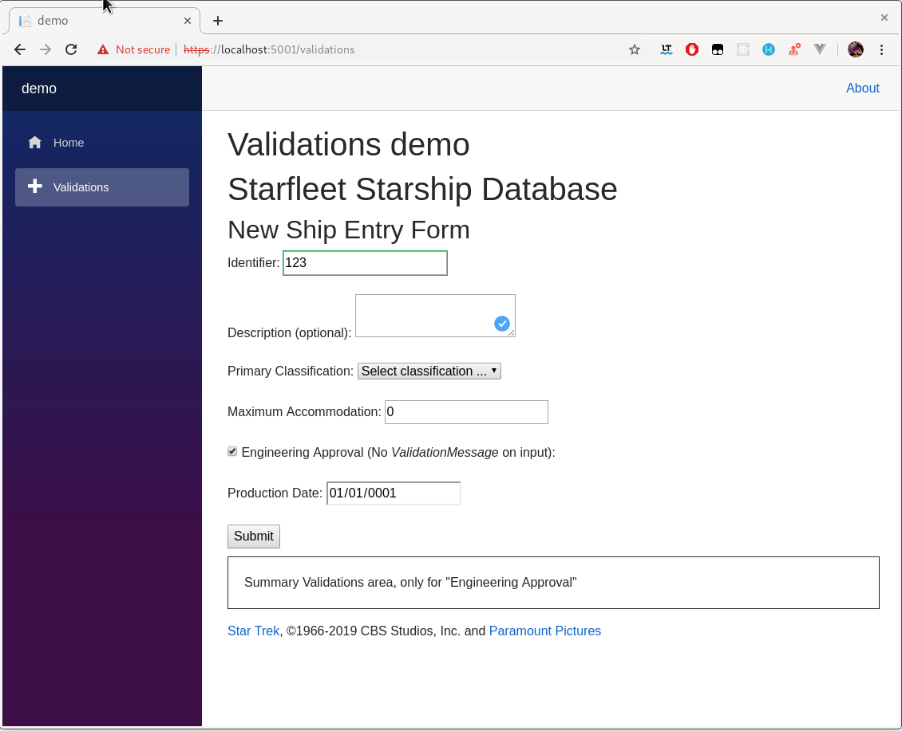

# Blazor EditForm Plus

### Learning #Blazor


This project is a demo about how to customize EditForm, ValidationMessage and ValidationSummary via inheritance to avoid dup messages. Ussualy messages  appear for twice: on member and on summary. This customization avoid dups.

In short:

* [`EditFormPlus` ](https://github.com/ctrl-alt-d/PowerBlazorForm/blob/master/src/PowerBlazorEditFormLib/EditFormPlus.cs) For replacing EditForm. It keep a list of members that have they own ValidationMessage.
* [`ValidationMessagePlus<TValue>`](https://github.com/ctrl-alt-d/PowerBlazorForm/blob/master/src/PowerBlazorEditFormLib/ValidationMessagePlus.cs) For replacing ValidationMessage. It know how to add itself EditFormPlus's members with they own ValidationMessage.
* [`ValidationSummaryPlus`](https://github.com/ctrl-alt-d/PowerBlazorForm/blob/master/src/PowerBlazorEditFormLib/ValidationSummaryPlus.cs) For replacing ValidationSummary. Is able to don't show messages for members on EditFormPlus's list.

Sample:

```c#

<EditFormPlus EditContext="@MyEditContext" OnValidSubmit="HandleValidSubmit">
    <DataAnnotationsValidator />
    <p>
        <label>
            Identifier:
            <InputText @bind-Value="_starship.Identifier" />
            <ValidationMessagePlus For="@( ()=>_starship.Identifier )" />
            <!-- It has validation message, will not appears dup on summary -->
        </label>
    </p>

    <p>
        <label>
            <InputCheckbox @bind-Value="_starship.IsValidatedDesign" />
            Engineering Approval (No <em>ValidationMessage</em> on input):
            <!-- It does not have validation message, will be appear on summary -->
        </label>
    </p>

    <p style="border: 1px solid; padding: 20px; margin-top: 10px">
        Summary Validations area, only for "Engineering Approval"
        <ValidationSummaryPlus />
    </p>

</EditFormPlus>
```

#### Screen shot 

_(because all us love screenshots)_




